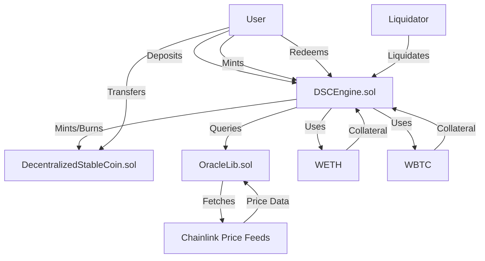

# Decentralized Stablecoin (DSC) System

## Overview

The Decentralized Stablecoin (DSC) System is a minimalistic, overcollateralized stablecoin protocol designed to maintain a 1:1 peg with the US dollar. It is exogenously collateralized, algorithmically stable, and inspired by MakerDAO's DAI system, but without governance or fees. The system supports collateral in WETH and WBTC, ensuring the protocol remains overcollateralized at all times.

### Key Features

- **Pegged to USD**: Each DSC token is pegged to $1.
- **Overcollateralized**: Requires at least 200% collateralization (configurable via `LIQUIDATION_THRESHOLD`).
- **Collateral Types**: Supports WETH and WBTC as collateral.
- **Price Feeds**: Utilizes Chainlink price feeds with safety checks to ensure data freshness (no older than 3 hours).
- **Security**: Implements `ReentrancyGuard` from OpenZeppelin to prevent reentrancy attacks.
- **Liquidation**: Allows liquidation of undercollateralized positions with a 10% bonus for liquidators.
- **Testing**: Includes comprehensive unit tests and fuzz testing to ensure robustness.

## 📌 Live Demo

- **Testnet Deployment**:
  DSC Coin Contract: [Sepolia Etherscan](https://sepolia.etherscan.io/address/0xd1475499FbbBf2f59394aE26d6C5302Dc9Da8d57#writeContract)
  DSCE Contract: [Sepolia Etherscan](https://sepolia.etherscan.io/address/0x7f4480ec9b3f18530c1bae168cdf0128020489f9)

## Contracts

### DSCEngine.sol

The core contract handling the logic for:

- Depositing and withdrawing collateral (WETH/WBTC).
- Minting and burning DSC tokens.
- Liquidating undercollateralized positions.
- Maintaining a health factor to ensure overcollateralization.

Key mechanisms:

- **Health Factor**: Ensures users maintain a minimum health factor (`MIN_HEALTH_FACTOR`) to prevent liquidation.
- **Price Feed Safety**: Uses `OracleLib` to check for stale price data (older than 3 hours).
- **Liquidation Threshold**: Enforces 200% overcollateralization.
- **Liquidation Bonus**: Offers a 10% bonus to liquidators for covering bad debt.

### DecentralizedStableCoin.sol

An ERC20 token contract representing the DSC stablecoin, with minting and burning functions restricted to the `DSCEngine` contract.

### OracleLib.sol

A library ensuring safe interaction with Chainlink price feeds, rejecting stale data (older than 3 hours) to maintain accurate pricing.

## Testing

The project includes robust testing to ensure reliability and security:

- **Unit Tests**: Comprehensive tests covering minting, burning, collateral management, and liquidation logic.

- Fuzz Testing

  : Implemented in 

  ```
  ContinueOnRevertHandler.t.sol
  ```

   and 

  ```
  ContinueOnRevertInvariants.t.sol
  ```

   using Foundry's fuzzing capabilities to stress-test the system under various conditions.

  - Tests invariants such as:
    - The protocol must always have more collateral value than the total DSC supply.
    - Users cannot mint DSC with a poor health factor.
    - Liquidation only occurs for users with a health factor below the minimum threshold.

## Invariants

The system enforces the following invariants:

1. The protocol must never be undercollateralized (total collateral value ≥ total DSC supply).
2. Users cannot mint DSC if their health factor is below `MIN_HEALTH_FACTOR`.
3. Only users with a health factor below `MIN_HEALTH_FACTOR` can be liquidated.

## Test Coverage


## Installation and Setup

### Prerequisites

- [Foundry](https://book.getfoundry.sh/) for building and testing.
- [Solidity](https://docs.soliditylang.org/) version `^0.8.19`.
- Dependencies: OpenZeppelin contracts and Chainlink price feed interfaces.

### Steps

1. **Clone the Repository**:

   ```bash
   git clone https://github.com/williamhjc/foundry-defi-stablecoin.git
   cd foundry-defi-stablecoin
   ```

2. **Install Dependencies**:

   ```bash
   forge install
   ```

3. **Compile Contracts**:

   ```bash
   forge build
   ```

4. **Run Tests**:

   ```bash
   forge test
   ```

5. **Run Fuzz Tests**:
   Ensure `forge-config: default.invariant.fail-on-revert = false` is set in your Foundry configuration, then run:

   ```bash
   forge test --match-contract ContinueOnRevertInvariants
   ```

## Deployment

1. Configure the `HelperConfig.s.sol` script with appropriate network settings (e.g., Chainlink price feed addresses for WETH/USD and WBTC/USD).

2. Deploy using the 

   ```
   DeployDSC.s.sol
   ```

    script:

   ```bash
   forge script script/DeployDSC.s.sol \
   --rpc-url $SEPOLIA_RPC_URL \
   --private-key $PRIVATE_KEY \
   --broadcast \
   --verify \
   --etherscan-api-key $ETHERSCAN_API_KEY \
   --slow
   ```

## Usage

1. **Deposit Collateral**: Call `depositCollateral` or `depositCollateralAndMintDsc` to deposit WETH/WBTC and optionally mint DSC.
2. **Mint DSC**: Use `mintDsc` to create DSC, ensuring your health factor remains above `MIN_HEALTH_FACTOR`.
3. **Redeem Collateral**: Call `redeemCollateral` or `redeemCollateralForDsc` to withdraw collateral and optionally burn DSC.
4. **Liquidate**: Liquidate undercollateralized users with `liquidate`, earning a 10% bonus on the collateral.
5. **Monitor Health Factor**: Use `getHealthFactor` to check your account's health factor.

## Security Considerations

- **Price Feed Safety**: The system uses `OracleLib` to reject stale or invalid Chainlink price data.
- **Reentrancy Protection**: Utilizes OpenZeppelin's `ReentrancyGuard`.
- **Overcollateralization**: Enforces a 200% collateralization ratio to mitigate insolvency risks.
- **Known Limitation**: If the protocol is exactly 100% collateralized (e.g., due to a sudden collateral price drop), liquidation may not be possible. Future improvements could include a treasury sweep for excess collateral.

## License

This project is licensed under the MIT License. See the `SPDX-License-Identifier: MIT` in the contract files for details.

## 📖 Contract Architecture


